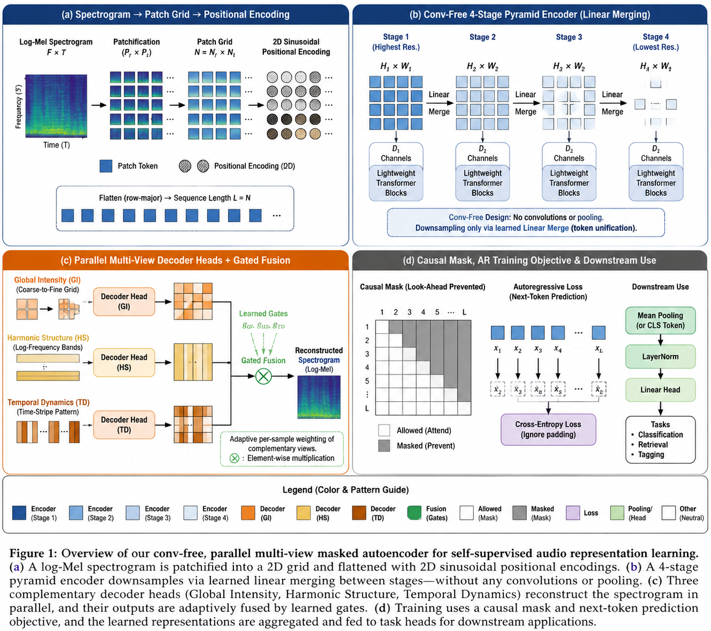

<p align="center">
  
</p>

<h1 align="center">Drawmoon</h1>

<p align="center">
  A frontend-first workflow orchestrator for multi-agent LLM &amp; CLI pipelines,
  built on top of <a href="https://github.com/anomalyco/opencode">OpenCode</a>.
</p>

<p align="center">
  <a href="#license"></a>
</p>

---

Drawmoon lets you design a graph of agent / LLM / CLI nodes on a visual console and
run it end to end: a planner fans out to parallel workers, artifacts hand off
between nodes, human-review gates pause for approval, and independent reviewers
converge on a consensus before a final build. It is provider-agnostic — mix
OpenCode agents, direct LLM API calls (DeepSeek, GPT-5.5, GPT Image), and local
CLIs (KIRO, Codex, Copilot) inside a single run, with per-node token accounting.

- **Visual console** — build, run, pause, resume, retry, and inspect workflows.
- **Deterministic control flow** — waves, retries, branch/merge, human gates, inquiries.
- **Any provider** — API keys or auto-detected local CLIs, chosen per node.
- **Real artifacts** — Markdown, LaTeX/PDF, and images produced on disk.

## Table of contents

- [Applications](#applications)
- [Quick start](#quick-start)
- [`~/.drawmoon` data directory](#drawmoon-data-directory)
- [Concepts](#concepts)
  - [Workflow template structure](#workflow-template-structure)
  - [Agent Mode structure](#agent-mode-structure)
  - [LLM API binding structure](#llm-api-binding-structure)
  - [The IO Planner](#the-io-planner)
- [Templates](#templates)
- [Demos](#demos)
- [Roadmap](#roadmap)
- [License](#license)

## Applications

The repository is a small monorepo of cooperating apps:

| App | Path | Role |
|-----|------|------|
| **Workflow Console** | `custom/workflow-frontend/` | The core product: a SolidJS + Vite single-page app to author graphs, launch runs, watch streaming output, inspect artifacts, manage templates, and configure providers/keys. Proxies `/api` to the backend. |
| **Runtime (backend)** | `backend/opencode/` | A Bun HTTP service (default port `3456`) that executes workflows: scheduling, retries, sessions, context handoff, provider dispatch (agent / LLM API / CLI), artifact persistence, and the IO allocator. |
| **OpenCode plugin** | `custom/opencode-plugin/` | Optional bridge plugin that exposes Drawmoon workflow tooling to an OpenCode session. |
| **Vendored OpenCode** | `backend/opencode/vendor/opencode/` | Upstream OpenCode, vendored so the runtime can drive it directly. Keeps its own license. |
| **Templates** | `templates/` | Importable starter JSON for LLM API bindings, Agent Modes, and Workflows. |
| **Demos** | `demos/` | Two complete real runs with templates, token usage, and outputs. |

Data flow: **Console → HTTP `/api` → Runtime → providers (OpenCode agent / LLM API / CLI) → artifacts on disk under `~/.drawmoon`.**

## Quick start

**Prerequisites:** [Bun](https://bun.sh) ≥ 1.3, and any provider you want to use
(a DeepSeek/Kuaipao API key, and/or a local CLI such as KIRO, Codex, or Copilot).

### 1. Runtime

```bash
cd backend/opencode
bun install
bun run dev -- --port 3456 --data-dir ~/.drawmoon/runtime
```

### 2. Console

```bash
cd custom/workflow-frontend
bun install
bun run dev
```

Open the printed Vite URL. The console proxies `/api` to the runtime on port 3456.

### 3. Credentials

Provide keys via environment variables or a plain `api` file (one key per line,
read from `~/.drawmoon/api` or the repo root). **No keys are committed here.**

| Variable | Purpose |
|----------|---------|
| `DEEPSEEK_API_KEY` | DeepSeek chat/reasoning models |
| `KUAIPAO_API_KEY` | Kuaipao-compatible OpenAI gateway (chat) |
| `KUAIPAO_CDK_1_API_KEY` | Kuaipao image models (e.g. GPT Image 2) |

Local CLIs (KIRO / Codex / Copilot) are auto-detected from `PATH`; no key needed.

Full setup, environment, and tests: [WORKFLOW_README.md](WORKFLOW_README.md)
(中文：[WORKFLOW_README.zh-CN.md](WORKFLOW_README.zh-CN.md)).

## `~/.drawmoon` data directory

All runtime state, registries, and imported templates live under `~/.drawmoon`
(home directory). Nothing here is committed to the repo.

```
~/.drawmoon/
├── api                       # optional API-key file (one "sk-..." per line)
├── runtime/                  # runtime data dir (--data-dir)
│   ├── workflow-runs/        # one JSON record per run (status, nodes, token usage)
│   └── cache/                # provider response cache (when caching is on)
├── workflow/                 # per-run entity workspaces
│   └── {run-key}/            # a run's working tree: artifacts, .workflow/, build/
├── workflow-output/          # published outputs, e.g. runs/{runId}/final.pdf
├── registry/                 # detected providers / CLI registry snapshots
├── library/                  # reusable capability library
│   ├── skills/               # skills (e.g. humanizer, drawio-grid-figures)
│   ├── mcp/                  # MCP server definitions
│   └── tools/                # custom tool definitions
└── templates/                # imported templates
    ├── workflows/            # workflow graphs
    ├── nodes/                # node/agent-mode/llm-api templates
    └── profiles/             # provider profiles
```

Per run, the runtime creates an isolated workspace at `~/.drawmoon/workflow/{run-key}/`.
Inside it, `.workflow/` holds orchestration state such as `allocation-plan.json`,
`blackboard.json`, and raw per-node outputs; product artifacts (LaTeX, PDFs,
images, Markdown) are written to the paths declared by the template and the IO plan.

## Concepts

A workflow is a JSON graph. Each **node** picks an **execution mode** and binds an
**Agent Mode** template and (optionally) an **LLM API** template. Nodes are wired
with **edges** (`normal` / `branch` / `merge`) that also declare how context is
handed off (`fresh` / `summary` / `artifacts` / `fork`).

### Workflow template structure

```jsonc
{
  "id": "my-workflow",
  "name": "My Workflow",
  "description": "...",
  "workingDirectory": "workflow-output",     // entity output root
  "defaultAgentId": "agent-paper",
  "agentModeTemplateIds": ["opencode-plan", "opencode-chat"],
  "llmApiTemplateIds": ["deepseek-deepseek-v4-flash"],

  // Kanban layout (purely visual grouping in the console):
  "stages":  [{ "id": "...", "name": "...", "columnIds": ["..."] }],
  "columns": [{ "id": "...", "name": "...", "stageId": "...", "lanes": [ ... ] }],

  "nodes": [
    {
      "id": "master-plan",
      "name": "Book Plan",
      "kind": "plan",                        // plan | agent-mode | llm-step | verify | condition
      "executionMode": "agent-mode",         // agent-mode | llm-api | cli | human-gate
      "agentModeTemplateId": "opencode-plan",
      "llmApiTemplateId": "kuaipao-gpt-5-5",
      "cliTemplateId": "opencode-cli",
      "promptTitle": "Book Plan",
      "promptPreview": "You are the lead planner ...",
      "artifacts": [{ "id": "...", "label": "master-plan.md", "kind": "markdown", "path": "..." }],
      "session": { "policy": "shared", "sessionKey": "book-plan", "turnOrder": 1 },
      "runtimeOverrides": { "contextMode": "fresh", "model": "gpt-5.5", "archetype": "planner" },
      "toolConstraints": { "forcedSkills": ["humanizer"], "forcedTools": ["latex_build"] }
    }
  ],

  "edges": [
    { "from": "master-plan", "to": "chapter-1", "kind": "branch", "contextMode": "fork" }
  ],
  "branchGroups": [{ "from": "master-plan", "to": ["chapter-1", "chapter-2"] }],
  "mergeGroups":  [{ "from": ["chapter-1", "chapter-2"], "to": "final-review" }],
  "sharedSessions": [{ "key": "book-plan", "anchorNodeId": "master-plan", "nodeIds": [ ... ] }],
  "inputMounts": [{ "name": "audiorwkv", "path": "audiorwkv" }]  // read-only input trees
}
```

Key ideas:

- **Execution modes** — `agent-mode` (OpenCode agent), `llm-api` (direct API call,
  incl. image/audio), `cli` (local tool like KIRO), `human-gate` (pause for approval).
- **Context modes** on edges/nodes — `fresh` (clean context), `summary` (compressed
  upstream), `artifacts` (read declared files), `fork` (branch a shared session).
- **Archetypes** (`runtimeOverrides.archetype`) — `planner`, `worker`, `merger`,
  `reviewer`, `gate`, `media` — drive failure semantics (hard vs soft) and retries.
- **Branch / merge groups** define fan-out and join points; the scheduler runs
  eligible nodes in waves.

### Agent Mode structure

An Agent Mode is a reusable execution profile bound to a node. The node's LLM is
usually chosen at runtime (`"model": "workflow-selected"`), so one mode works with
any provider.

```jsonc
{
  "id": "opencode-chat-starter",
  "name": "OpenCode Chat (starter)",
  "provider": "opencode",
  "strategyKind": "cli",                     // how the runtime drives the agent
  "mode": "chat",                            // plan | build | chat | agent | review
  "model": "workflow-selected",              // or "inherited" / a concrete id
  "contextMode": "fresh",
  "defaultSystemPrompt": "Use OpenCode chat mode to answer the node objective.",
  "allowSystemPromptOverride": true,
  "allowedTools": ["read_file", "artifact_link"],
  "allowFileWrites": false,
  "outputKinds": ["markdown"],
  "maxIterations": 4,
  "timeoutMs": 300000,
  "constraints": { "forcedMcpServers": ["workflow-io"], "forcedSkills": [] },
  "defaultRuntimeOverrides": { "archetype": "worker" },
  "fieldPolicy": { "model": "inherited", "defaultSystemPrompt": "editable" },
  "retryPolicy": { "attempts": 1, "backoffMs": 0, "continueOnPartialFailure": true }
}
```

`fieldPolicy` controls which fields a workflow author may override in the console
(`editable` / `inherited` / locked). `constraints` can force MCP servers, skills,
or tools for every node using the mode.

### LLM API binding structure

An LLM API template is a provider binding a node calls directly (or that an Agent
Mode resolves its model against):

```jsonc
{
  "id": "deepseek-v4-flash-starter",
  "provider": "custom",
  "endpoint": "https://api.deepseek.com/v1",
  "protocol": "openai-compatible",           // wire format
  "model": "deepseek-v4-flash",
  "modalities": ["text"],                    // text | image | audio
  "contextWindow": 128000,
  "apiKeyEnv": "DEEPSEEK_API_KEY",           // key is read from env, never inlined
  "responseFormat": "markdown",
  "timeoutMs": 300000,
  "retryPolicy": { "attempts": 1, "backoffMs": 0, "continueOnPartialFailure": false }
}
```

### The IO Planner

For multi-node pipelines that must produce a coherent file tree (e.g. a paper), the
special **`custom-io-planner`** Agent Mode plans the filesystem up front. Its first
output block is a JSON allocation plan that the runtime **hard-executes**:

```jsonc
{
  "writeRoot": ".",                          // single shared output root
  "folders": ["paper/sections"],             // created before any worker runs
  "files": [
    {
      "flat": "section-intro.md",            // flat name a worker writes (no subdirs)
      "dest": "paper/sections/intro.md",     // final path after migration
      "producer": "section-intro",           // node id that owns this file
      "criticality": "critical"              // missing critical files trigger a repair gate
    }
  ]
}
```

Lifecycle: the planner emits the plan (`\.workflow/allocation-plan.json`) → the
runtime creates `folders` → each worker writes its **flat** staging file → the
runtime deterministically **migrates flat → dest** and validates every declared
file exists. This removes path collisions between parallel workers and makes the
final layout predictable regardless of what each agent decides to name things.

## Templates

Import starters from [`templates/`](templates/README.md):

| Type | Starter |
|------|---------|
| LLM API | `templates/llm-api/deepseek-v4-flash-starter.json` |
| Agent Mode | `templates/agent-mode/opencode-chat-starter.json` |
| Workflow | `templates/workflow/opencode-deepseek-chat-starter.json` |

Bundled workflow templates also include `audiorwkv-iclr-pyramid` (paper pipeline),
`icml-to-tmm-sinkhorn`, and `paper-journal-default`.

## Demos

Two complete, unedited runs live under [`demos/`](demos/README.md), each with its
execution template, per-node token usage, execution entities, and real outputs.

| Demo | Pipeline | Nodes | Total tokens | Output |
|------|----------|:-----:|:------------:|--------|
| [ICLR paper](demos/iclr-audiorwkv/) | Plan → parallel sections + figures → merge/compile → human gate → 4 reviews → revision | 25 | ~6.42M | `final.pdf` + 3 figures |
| [Xuanhuan novel + cover](demos/xuanhuan-novel-4grid/) | Plan → 4 forked chapters → final edit → cover image | 7 | ~0.95M | `final-novel.pdf` + AI cover |

<p align="center">
  
  
</p>

## Roadmap

Planned work — contributions and ideas welcome:

- **More node types** — loop / iterator nodes, sub-workflow (nested graph) nodes,
  map-reduce over collections, tool-only (no-LLM) transform nodes, scheduled /
  webhook trigger nodes, and richer conditional routing.
- **Mobile control** — a responsive mobile view to monitor runs, approve human
  gates, answer planner inquiries, and start/stop/retry workflows from a phone,
  with push notifications on gate/inquiry/failure events.

## License

Drawmoon is licensed under **Creative Commons Attribution-NonCommercial 4.0
International (CC BY-NC 4.0)** — see [LICENSE](LICENSE).

- **NonCommercial** — commercial use is not permitted without a separate written
  license from the author.
- **Attribution** — redistribution (original or modified) must credit
  "Drawmoon by Jiayu Xiong" and link back to this repository and the license.

Vendored upstream OpenCode under `backend/opencode/vendor/opencode/` retains its
own original license. For commercial licensing, contact the author via
[github.com/Jiayu-Xiong](https://github.com/Jiayu-Xiong).
