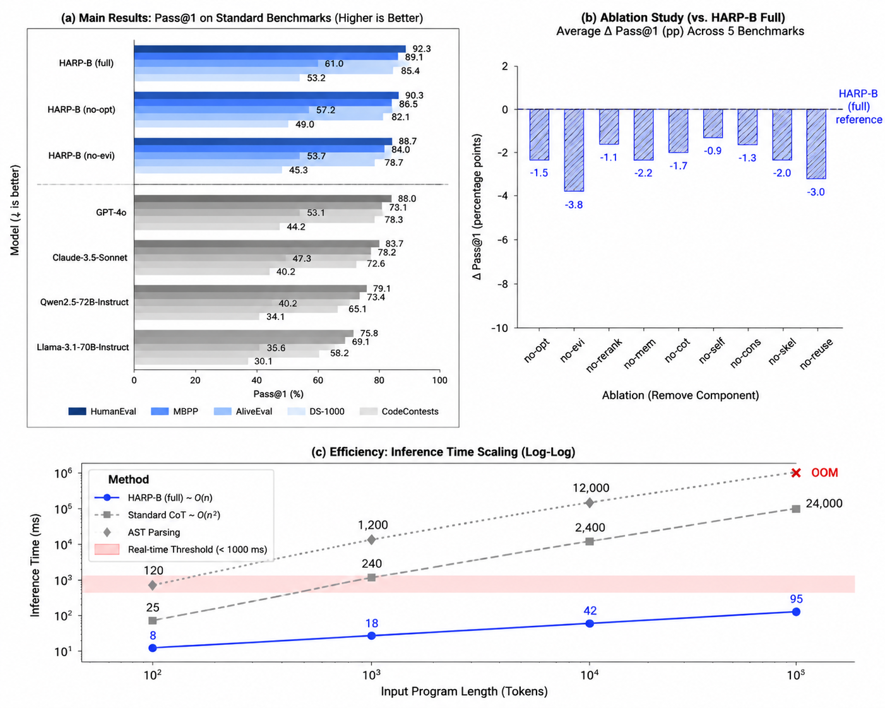
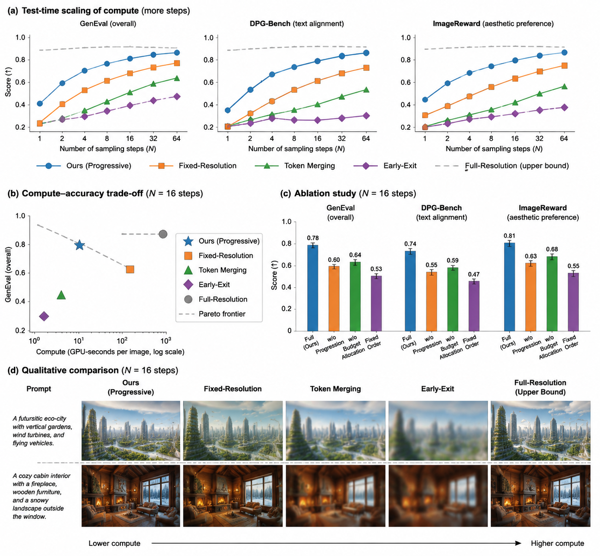

# Demo — AudioRWKV → ICLR paper pipeline

A 25-node workflow that turns a source manuscript into a camera-ready ICLR
submission: an architect plans the paper and fans out to five parallel section
writers and three figure tracks, everything merges into a compiled PDF, a human
gate approves submission, four independent reviewers converge on consensus
must-fix items, and a single revision pass produces the final PDF.

- **Template:** [`template.json`](template.json) (id `audiorwkv-iclr-pyramid`)
- **Status:** completed · 25/25 nodes
- **Active compute:** ~54 min (wall-clock spans an overnight human-review pause)
- **Machine-readable summary:** [`run-summary.json`](run-summary.json)

## Token consumption

| | Input | Output | Cache read | Total |
|---|---:|---:|---:|---:|
| **Run total** | 540,683 | 128,210 | 5,752,704 | **6,421,597** |

## Execution entities

| Node | Kind | Executor | Model / provider |
|------|------|----------|------------------|
| architect-plan | planner (+ author inquiry) | `custom-io-planner` | DeepSeek V4 Pro |
| section-intro / related-work / methodology / experiments / conclusion | worker | `opencode-paper-section` (humanizer) | DeepSeek V4 Flash |
| figure/experiment/teaser-prompt | worker | `opencode-build` (drawio skill) | DeepSeek V4 Flash |
| figure/experiment/teaser-render | media | `direct-api` | GPT Image 2 |
| body-text / round1-merge / layout-audit / length-audit / final-pdf | merger / compile | `opencode-paper-compile` (latex_build, pdf_audit) | DeepSeek V4 Flash |
| submit-review-gate | human gate | — | pauses for approval |
| kiro-review-ds / -mm / -qwen | reviewer | KIRO CLI | deepseek-3.2 / minimax-m2.5 / qwen3-coder-next |
| deepseek-pro-review | reviewer | `opencode-paper-reviewer` | DeepSeek V4 Pro |
| review-intersection / revision-plan / revision-major | merger / planner / worker | opencode paper agents | DeepSeek V4 Pro / Flash |

## Per-node token usage

| Node | Entity | Input | Output | Cache read | Total |
|------|--------|---:|---:|---:|---:|
| architect-plan | DeepSeek V4 Pro | 77,818 | 35,890 | 680,320 | 794,028 |
| figure-prompt-1 | DeepSeek V4 Flash | 10,893 | 4,158 | 20,864 | 35,915 |
| figure-render-1 | GPT Image 2 | — | — | — | image node |
| experiment-figure-prompt | DeepSeek V4 Flash | 11,682 | 3,606 | 21,376 | 36,664 |
| experiment-figure-render | GPT Image 2 | — | — | — | image node |
| teaser-figure-prompt | DeepSeek V4 Flash | 10,792 | 2,577 | 19,456 | 32,825 |
| teaser-figure-render | GPT Image 2 | — | — | — | image node |
| section-intro | DeepSeek V4 Flash | 16,316 | 1,651 | 54,784 | 72,751 |
| section-related-work | DeepSeek V4 Flash | 27,263 | 2,294 | 100,480 | 130,037 |
| section-methodology | DeepSeek V4 Flash | 20,679 | 3,385 | 81,920 | 105,984 |
| section-experiments | DeepSeek V4 Flash | 28,380 | 4,545 | 149,248 | 182,173 |
| section-conclusion | DeepSeek V4 Flash | 18,219 | 944 | 52,992 | 72,155 |
| body-text | DeepSeek V4 Flash | 42,096 | 4,343 | 474,112 | 520,551 |
| round1-merge | DeepSeek V4 Flash | 61,687 | 13,655 | 1,040,768 | 1,116,110 |
| submit-review-gate | human gate | — | — | — | — |
| layout-audit | DeepSeek V4 Flash | 50,695 | 2,244 | 248,960 | 301,899 |
| length-audit | DeepSeek V4 Flash | 32,400 | 21,691 | 1,355,520 | 1,409,611 |
| kiro-review-ds | KIRO deepseek-3.2 | — | — | — | CLI node |
| kiro-review-mm | KIRO minimax-m2.5 | — | — | — | CLI node |
| kiro-review-qwen | KIRO qwen3-coder-next | — | — | — | CLI node |
| deepseek-pro-review | DeepSeek V4 Pro | 11,132 | 2,662 | 41,088 | 54,882 |
| review-intersection | DeepSeek V4 Flash | 11,283 | 1,152 | 44,288 | 56,723 |
| revision-plan | DeepSeek V4 Pro | 22,537 | 6,857 | 53,120 | 82,514 |
| revision-major | DeepSeek V4 Flash | 22,441 | 11,766 | 214,400 | 248,607 |
| final-pdf | DeepSeek V4 Flash | 64,370 | 4,790 | 1,099,008 | 1,168,168 |

## Execution output

- **[`outputs/final.pdf`](outputs/final.pdf)** — final compiled manuscript.
- **[`outputs/figures/`](outputs/figures/)** — AI-generated method, experiment, and teaser figures.
- **[`outputs/reviews/`](outputs/reviews/)** — the four peer reviews + consensus intersection.
- **[`outputs/plan/`](outputs/plan/)** — architecture plan and venue requirements.

  
  
  

